# OLS50C RDK Tutorial (C#)
The OLS5000 Remote Development Kit (OLS5000 RDK) provides communication functions via sockets. The RDK enables the control of OLS50000 acquisition and measurement operations using commands by connecting a User’s PC as the external communication device.

This quick start tutorial guides you through installing and running example code written in C# to get you started. The sample project is developed based on .NET Framework 4.6 and can be download [here](https://github.com/ospqul/OLS50C_RDK_Demo). The details of all the commands used in the example code can be found in the **OLS5000 RDK User's Manual**. 

The RDK mainly includes the commands of Data Acquisition App, but does not have full control of the Analysis App. The post-processing steps, such as exporting measured results into CSV format and saving the acquired images, can be included in a macro file and executed by the RDK. Here is a brief overview on what the RDK CAN do and CANNOT do:

**The RDK CAN:**

- Login and initialize OLS5000
- Move the X-Y stage
- Move the Z Revolver
- Switch Objective Lens
- Change Zoom
- Start / Stop Acquisition
- Load / Start / Stop Macro Execution
- Start / Stop the LIVE image display of OLS5000

**The RDK CANNOT:**

- Receive measured results
- Output the measured results into CSV format
- Save the acquired images
- Save the reports

### 1 Installation

Go to the software installer folder `OLS50C-RDK_vxxx`, double-click `setup.exe`, and follow the instructions to install on the **Controller PC**. 

The **User PC** is the remote PC used to communicate with RDK Server; the **Controller PC** is the local PC that runs the RDK Server and controls the OLS5000. The **User PC** must be a separate PC from the **Controller PC**.

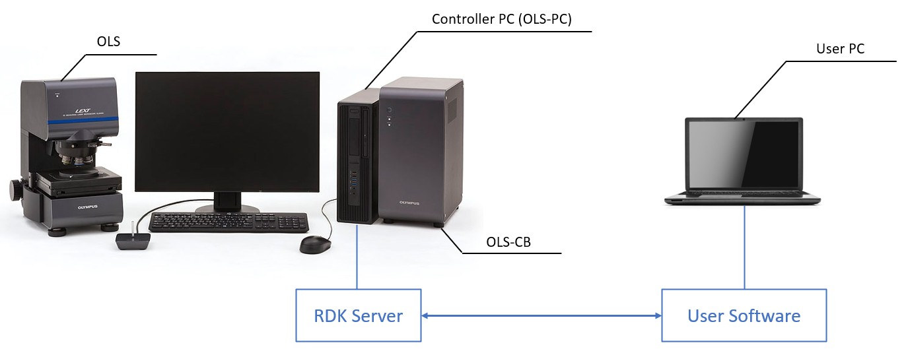

### 2 Network Settings

The User PC communicates with the Controller PC via sockets, so both PCs are required to connect onto the same network. You can either connect the User PC and the Controller PC with an ethernet cable directly, or connect both to the same network switch.

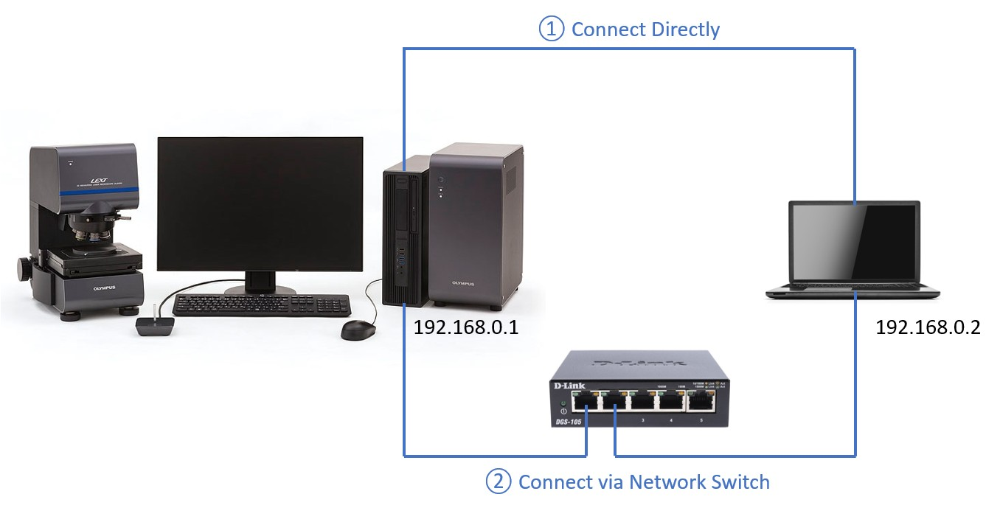

#### 2.1 Controller PC

The default IP address of the Controller PC is `192.168.0.1`.

#### 2.2 User PC

The User PC's IP address shall be set to a static IP address within the same IP range, for example:

```cs
IP address: 192.168.0.2
Subnet mask: 255.255.255.0
```

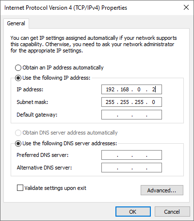

You can use the following command in **Command Prompt** to check if the connection is successful.

```bash
ping 192.168.0.1
```

If the connection is successful, you will see a similar reply from the host as below:

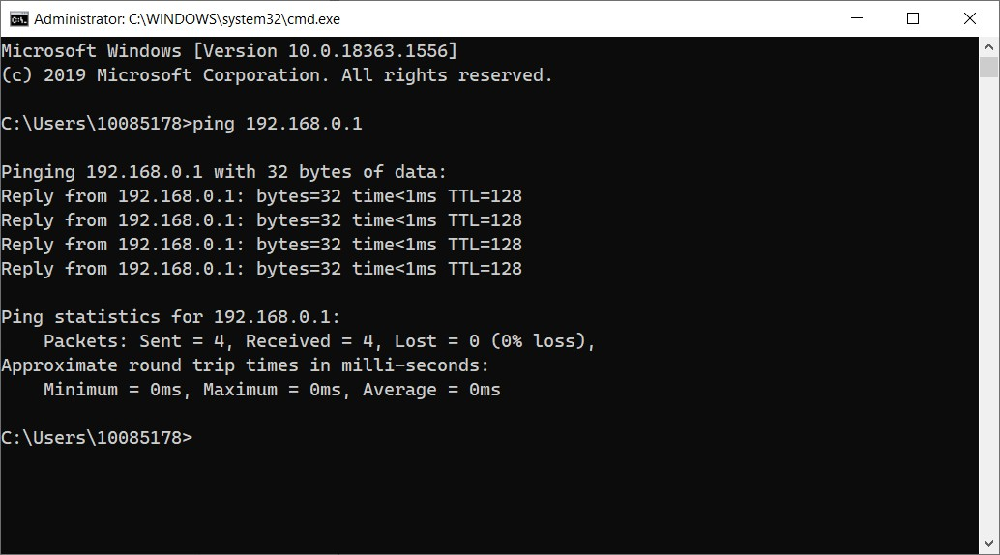

### 3 Example Use of the RDK

> :warning: **WARNING:**
>
> 1. Be aware of the moving parts of the OSL5000.
>
> 2. Make sure the X-Y stage has ample space to operate freely.
>
> 3. Make sure the sample will not be hit by the lens when switching the lenses or moving the Z axis.

#### 3.1 Initialize

#### 3.1.1 Connect TCP

The RDK Server runs as a TCP Server, and a TCP Client can connect to its port `50100`.

Here is a sample `ClientModel`class to implement the basic functions of a TCP Client:

https://github.com/ospqul/OLS50C_RDK_Demo/blob/main/OLS50C_RDK_Demo/ClientModel.cs

##### Connect()

------

Connect to the TCP server with an IP address and port number.

##### Close()

---

Close the TCP connection.

##### Write()

---

Send a text message to the TCP Server.

**Receive()**

---

Receive a text message from TCP Server.

#### 3.1.2 Request Connection

**Command:**

`CONNECT= 0`

Description:

Establishes the connection with the OLS5000.

#### 3.1.3 Request Normal Start

**Command:** 

`INITNRML= TMELD,olympus`

Description: 

Specifies the Login ID and Password to start and initialize the OLS5000. Once the RDK Server receives this command, it will launch the Data Acquisition Application and the Analysis Application in remote mode. 

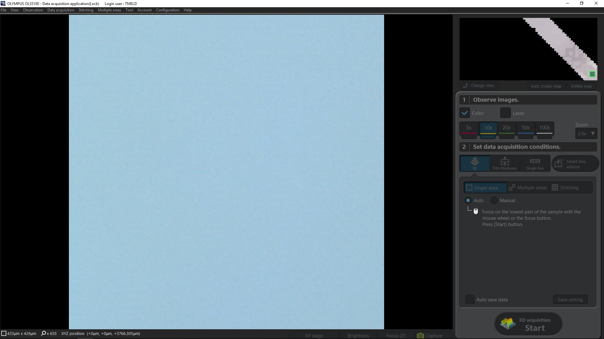

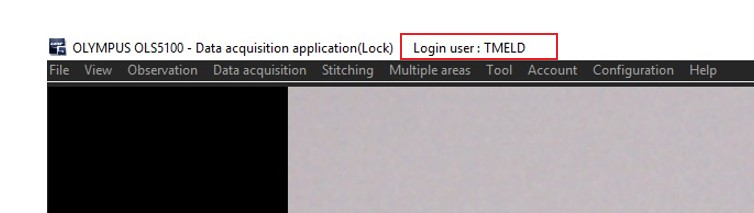

#### 3.2 Functions

#### 3.2.1 Move Stage

**Command:**

`MVSTG= x,y`
*x			X coordinate [µm]*
*y			Y coordinate [µm]*

Description: 

Moves the motorized X-Y stage to the specified coordinates.

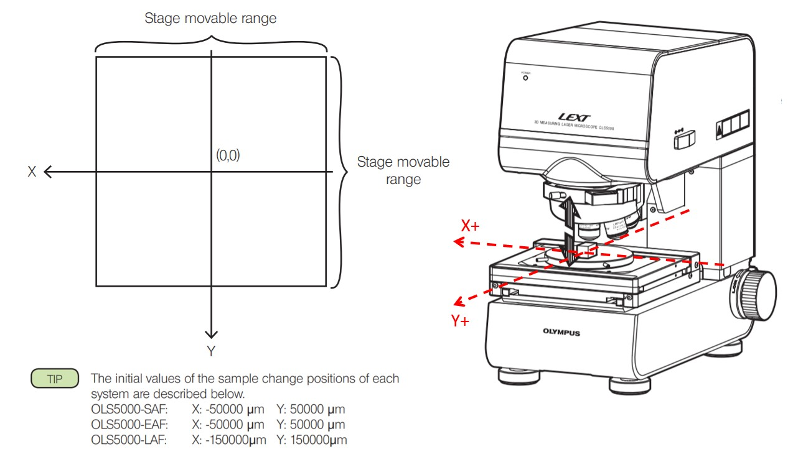

Move out the stage: `MVSTG= -50000,50000`

Move in the stage: `MVSTG= 0,0`

>:warning: **WARNING:**
>
>Make sure the X-Y stage has ample space to operate freely before sending this command.

#### 3.2.2 Switch Objective Lens and Change Zoom

**Switch Lens Command:**

`CHOB= OB`

OB = 1, 2, 3, 4, 5, 6

Description: 

Changes to the objective lens specified by rotating the Z Revolver of OLS5000. For example `CHOB= 2` command will switch to the second objective lens.

>  :warning: **WARNING:**
>
> Make sure the lens will not hit the sample on the stage.

**Change Zoom Command:**

`CHZOOM= ZOOM`

ZOOM = 10, 12, 15, 20, 30, 40, 60, 80

Description: 

Changes the zoom magnification of OLS5000 to the specified magnification. For example, `CHZOOM= 30` command will change the zoom to x3.0.

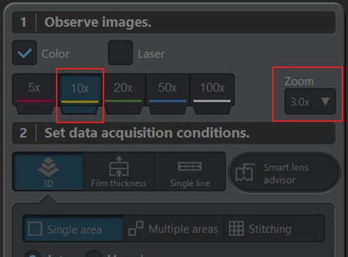

#### 3.2.4 Move to the Home Position

**Command:**

`MVZHOME= 0`

**Description:** 

Moves Z Revolver of OLS5000 to the home position.

> :warning: **WARNING:**
>
> Make sure the lens will not hit the sample on the stage.

#### 3.2.5 Load and Execute Macros

**Load Macros Command:**

`RDWIZ= NAME`

NAME: Macro Names (Any of the returned values of `GETWIZNAME?` command)

Description: 

Loads the macros registered in OLS5000. For example, `RDWIZ= macro1.mcr` command will load macro1.mcr.

**Execute Macros Command:**

`WIZEXE= 0`

Description: 

Starts the execution of macros opened in OLS5000. `WIZEXE= +` is returned after completion of macro.

### 3.3 Disconnect

#### 3.3.1 Switch Modes

**Command:**

`CHMODE= MODE`

MODE = 0 Local Mode

MODE = 1 Remote Mode

Description: 

Switches OLS5000 mode (Remote / Local) from User PC. For example, send `CHMODE= 0` command to switch OLS5000 to local mode before disconnect.

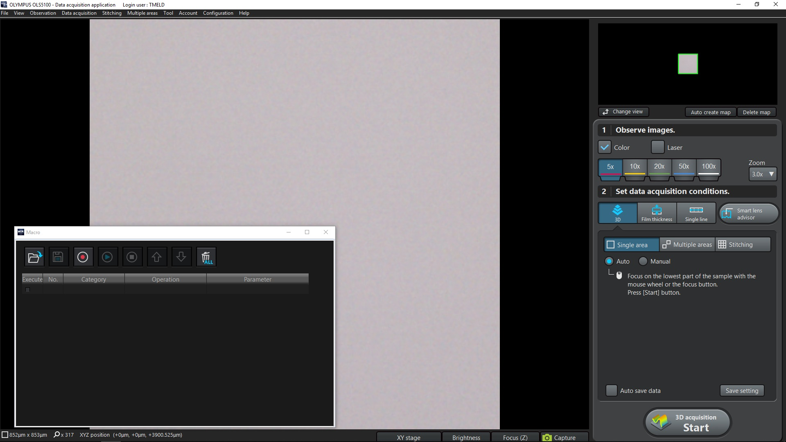

#### 3.3.2 Request Disconnection

**Command:**

`DISCONNECT= 0`

Description: 

Disconnects from the OLS5000.

Here is an example of code: https://github.com/ospqul/OLS50C_RDK_Demo/blob/main/OLS50C_RDK_Demo/Program.cs

### 4 RDK User App

The RDK includes a sample user application in `C:\Olympus\OLS50C-RDK\tools\RdkUserApp`, as well as the scripts for common actions.

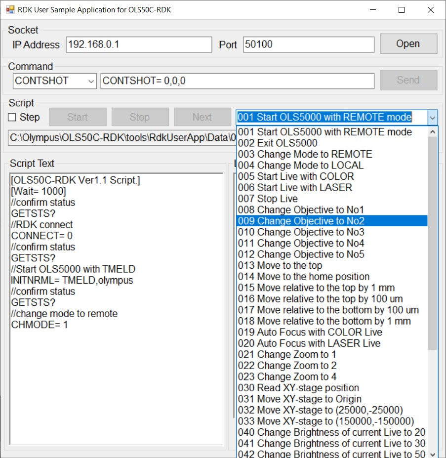


### 5 Troubleshooting Guide

#### 5.1 Communication Error

**Problem Description:**

Failed to connect to `192.168.0.1` port `50100`.

**Possible Reason 1:**

The network settings are incorrect.

**Fix 1:**

Follow Section **2 Network Settings** to set IP Addresses.

**Possible Reason 2:**

The Lan cable between the **Controller PC** and the User PC is broken.

**Fix 2:**

Reconnect Lan cables.

**Possible Reason 3:**

An existing Client is connected to the RDK Server.

> :warning:Note: The RDK Server can only connect to one Client.

**Fix 3:**

Disconnect the existing client, and reconnect to the RDK Server.

#### 5.2 Normal Start Timeout

**Problem Description:**

After sending **Request Normal Start** command `INITNRML= TMELD,olympus`, the completion notification `INITNRML= +` is not returned within two minutes.

**Possible Reason:**

The Macro application is not open.

**Fix:**

Open Macro application manually. The default location in the **Controller PC**:

`C:\Program Files\OLYMPUS\LEXT-OLS50-SW\MacroApp\MacroApp\macro.exe`

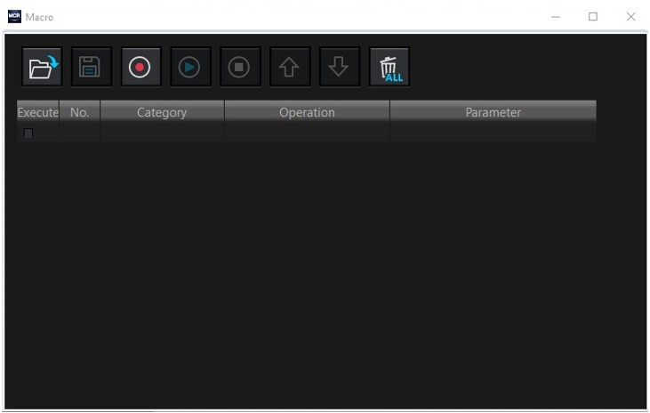